<p align="center">
  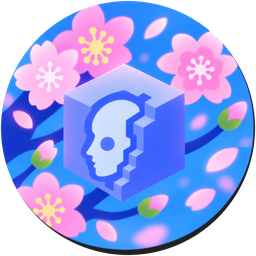
</p>

<h1 align="center">AscendCord</h1>

<p align="center">
  A fast, native Discord client written in Rust.<br />
  Real stereo voice, low memory use, Vencord-style themes and a lot of small comforts.
</p>

<p align="center">
  <a href="https://github.com/Cxsmo-ai/AscendCord/releases/latest"></a>
  <a href="https://github.com/Cxsmo-ai/AscendCord/releases"></a>
  <a href="https://github.com/Cxsmo-ai/AscendCord/actions/workflows/ci.yml"></a>
  <a href="#license"></a>
  
</p>

<p align="center">
  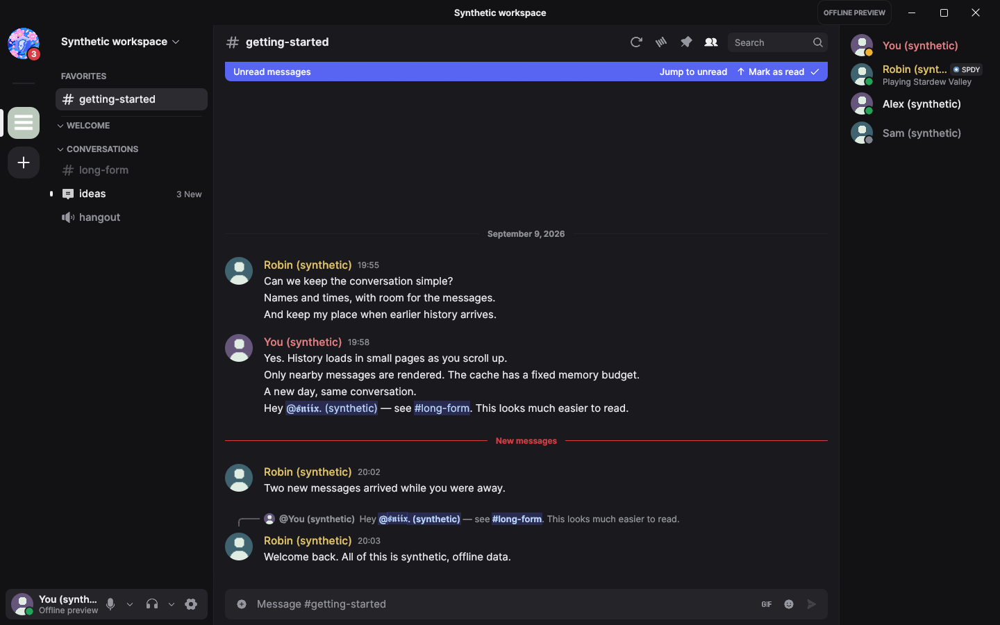
</p>

> [!WARNING]
> AscendCord is an unofficial client and is not affiliated with or endorsed by Discord.
> Third-party clients are against Discord's Terms of Service, so use it at your own risk.

## Download

| Platform | Get it |
|---|---|
| **Windows 10/11** | [Installer or portable zip](https://github.com/Cxsmo-ai/AscendCord/releases/latest) |
| **Arch Linux** | `PKGBUILD` attached to each release (see [Arch Linux](docs/building-arch.md)) |
| **From source** | [Windows](docs/building-windows.md) · [Arch Linux](docs/building-arch.md) |

Every release lists SHA-256 checksums in `SHA256SUMS.txt`. Installed Windows builds can
update themselves from **Settings → Updates**.

## Why AscendCord

- **Native.** Rust with egui and wgpu instead of Electron. In a voice call it uses
  about 200 MB of RAM on Windows.
- **Voice that sounds like the source.** True stereo Opus at up to 510 kb/s constant
  bitrate, no noise suppression or auto gain unless you turn them on, and capture at your
  device's native sample rate with a high-quality resampler. Steady 20 ms packet pacing
  keeps it free of stutter.
- **Your look.** 19 app icon styles (window, taskbar, tray and in-app), native themes, and
  import of **Vencord / BetterDiscord `.css` themes** straight from a file.
- **Familiar.** Right-click menus follow Discord's: quick reactions, Copy Message Link,
  server mute / deafen / move / disconnect, and Copy ID items behind Developer Mode.
- **Extras built in.** Ports of popular TestCord plugins, multiple accounts, a tray icon,
  global push-to-talk, and screen sharing, camera and stream viewing.

## Screenshots

| | |
|---|---|
| 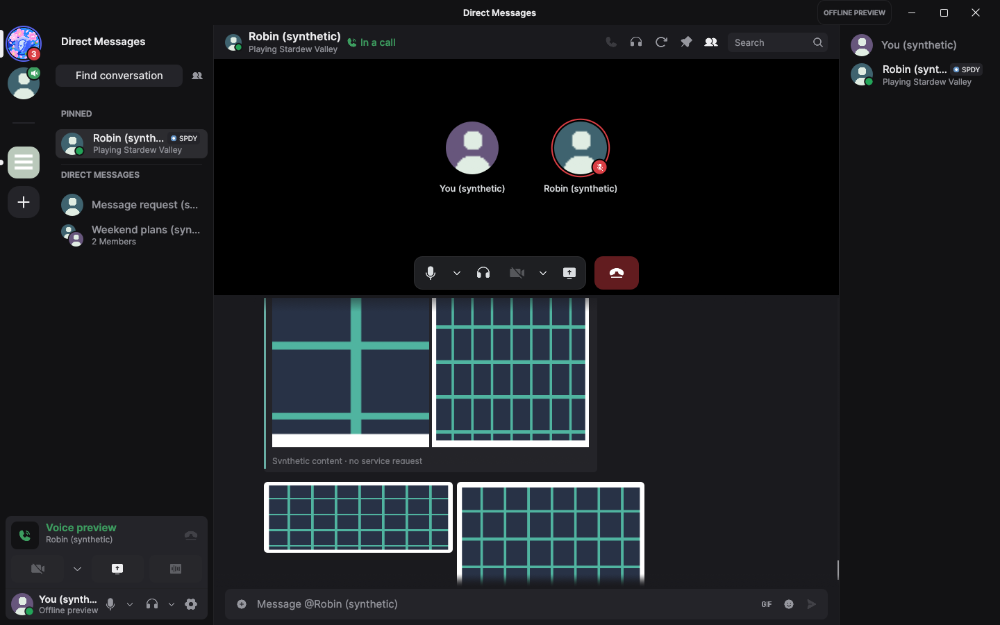 | 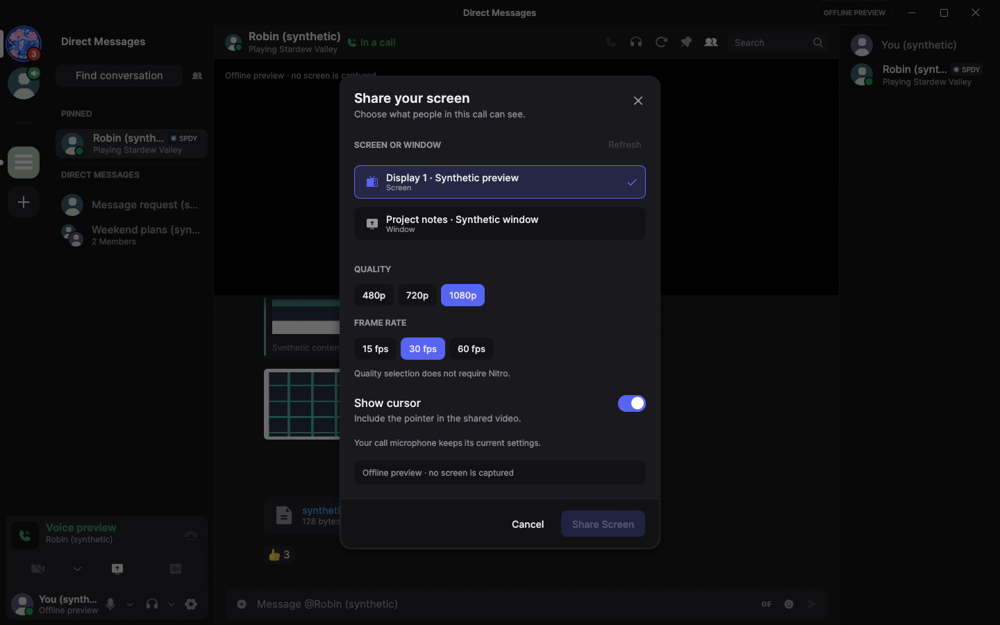 |
| 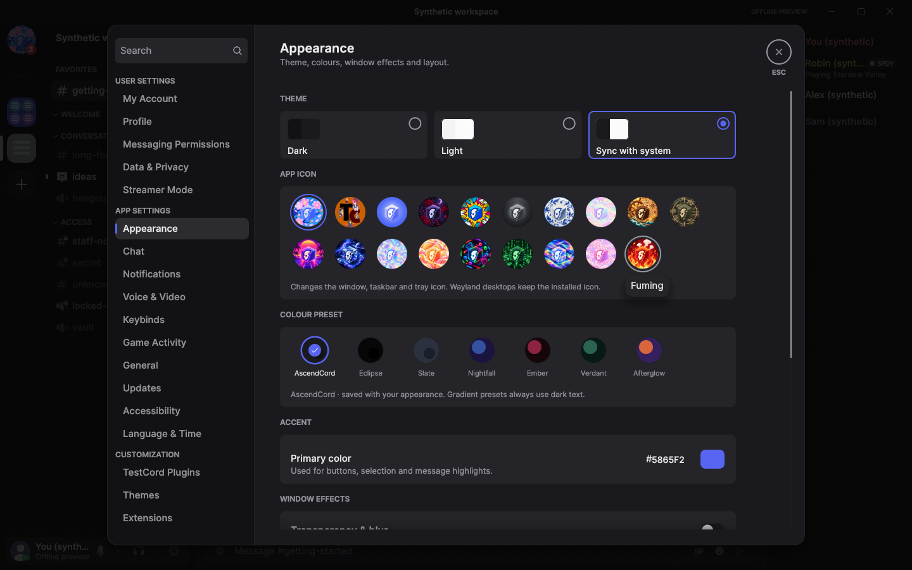 | 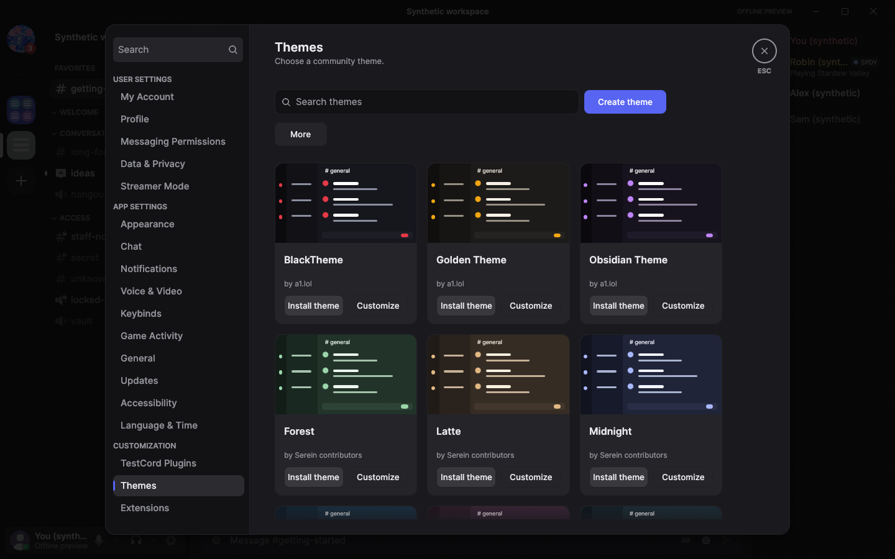 |
| 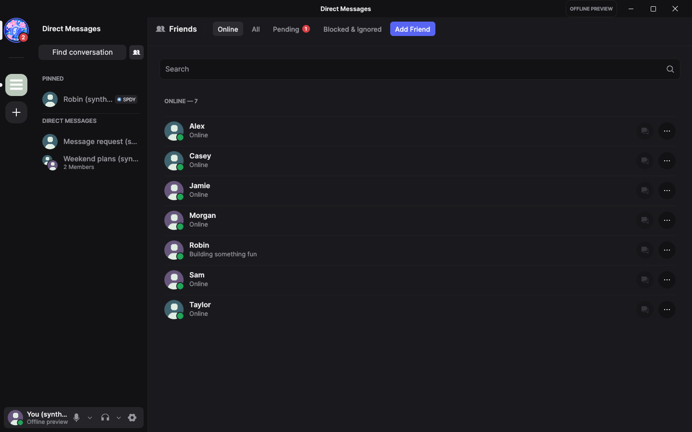 | 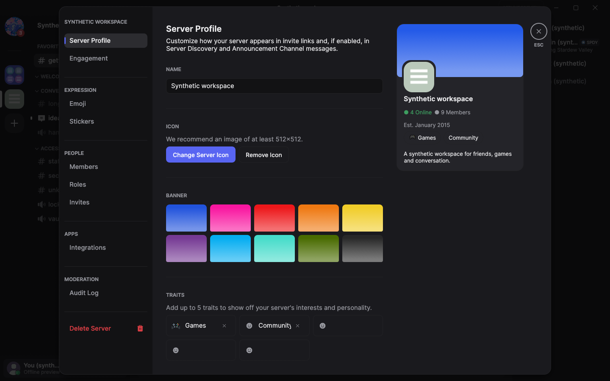 |
| 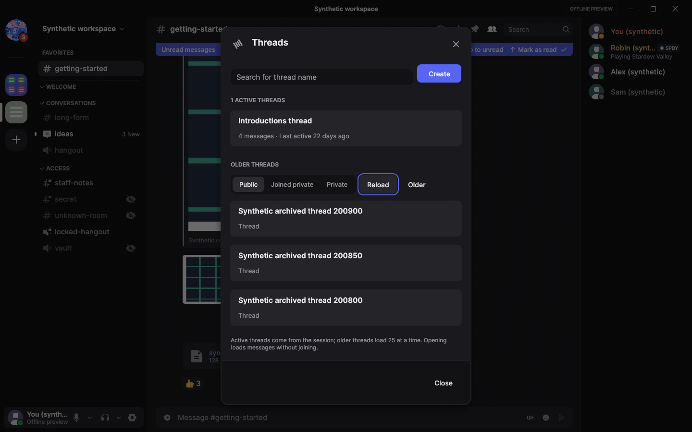 | 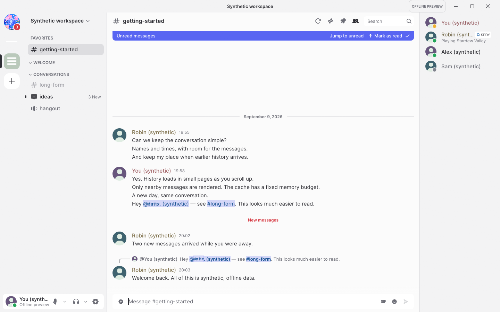 |

<details>
<summary>More screenshots</summary>

| | |
|---|---|
| 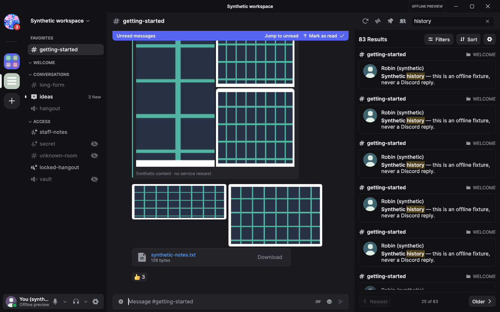 | 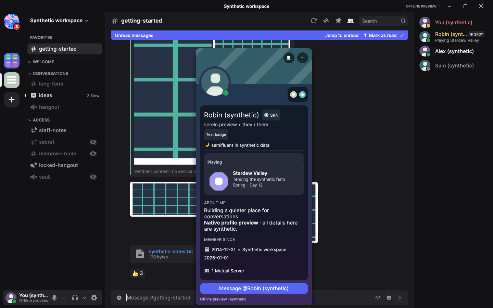 |
| 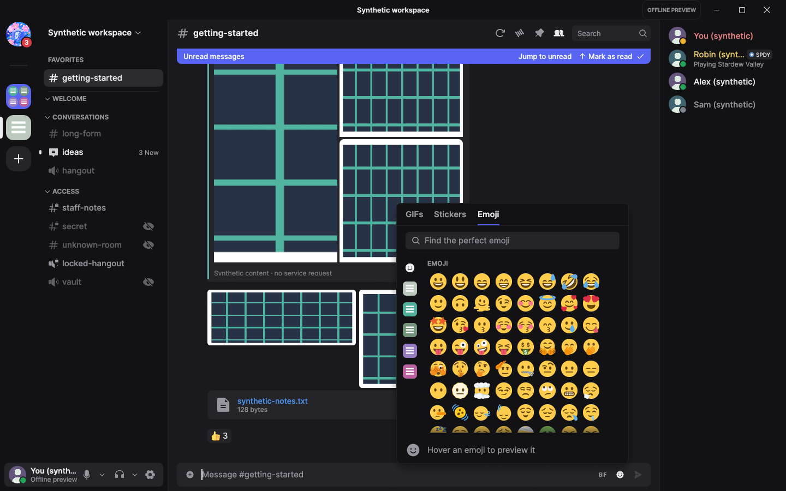 |  |

</details>

All screenshots come from the built-in demo mode, which uses made-up data, and are
regenerated with `scripts/capture-screenshots.ps1`.

## Themes

Settings → Themes → **Import** accepts AscendCord theme packages and Discord `.css` themes
from Vencord or BetterDiscord. AscendCord reads the theme's colour variables (both the
classic names like `--background-primary` and the newer `--background-base-*` ones),
light and dark variants, and its background image, then turns them into a native theme.
Nothing from the file is executed. If a theme pulls more files from the web, the import
preview asks before downloading them. See [Theme API](docs/theme-api.md) to make a native
theme by hand.

## Building

```sh
git clone https://github.com/Cxsmo-ai/AscendCord.git
cd AscendCord
cargo run --release
```

Platform requirements: [Windows](docs/building-windows.md) · [Arch Linux](docs/building-arch.md).
More reading: [architecture](docs/architecture.md), [voice](docs/voice.md),
[performance](docs/performance.md), [context menus](docs/menu-parity.md),
[extensions](docs/extensions.md).

## Updating from tesktop2

AscendCord used to be called tesktop2. On first launch it copies your settings, installed
extensions and sign-in from the old folder and keyring entry; the old copies are left as
they were.

## Credits

AscendCord builds on [Serein](https://github.com/ViceVerse-cz/Serein), the native Rust
Discord client by its contributors, and ports plugins from TestCord. Emoji are from
Twemoji, icons from Phosphor and Simple Icons. Full notices are in
[THIRD_PARTY_NOTICES.md](THIRD_PARTY_NOTICES.md).

## License

Licensed under either of [MIT](LICENSE-MIT) or [Apache-2.0](LICENSE-APACHE), at your option.
